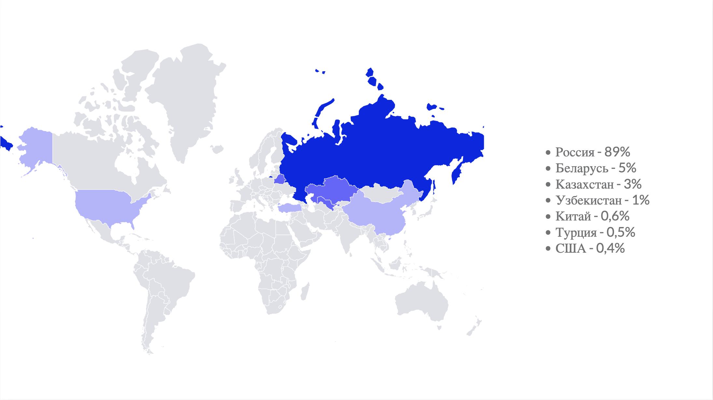

# Яндекс поиск
___
## Содержание
1. [Тема и целевая аудитория](#1-тема-и-целевая-аудитория)
2. [Расчет нагрузки](#2-расчет-нагрузки)
3. [Глобальная балансировка нагрузки](#3-глобальная-балансировка-нагрузки)
___
## 1. Тема и целевая аудитория

Яндекс поиск - поисковая система

### Функционал MVP:

- Составление поисковых запросов
- Запоминание истории поиска
- Подсказки при поиске
- Поддержка ошибчного ввода

### Целевая аудитория

#### MAU ~ 100  млн. чел.
#### DAU ~ 3.3 млн. чел.
#### Visit duration ~ 8:00 мин.
#### Pages per. visit - 8.36
#### Bounce Rate - 27.05%

### Распределение аудитории


*Данные взяты с сайтов [Inclient](https://inclient.ru/yandex-stats/) и [hypestat](https://hypestat.com/)*
___
## 2. Расчет нагрузки

### Продуктовые метрики

* DAU - 3.3 млн / MAU - 100 млн.
* Кол-во посковых запросов в месяц ~25 млрд.
* Кол-во активных пользователей ~100 млн. чел.
* Кол-во проиндексированных страниц ~10 млрд.
 
### Объем хранимых данных


| Данные               | Размер ед. | Кол-во на 1 пользователя | Суммарный объем |
|----------------------|------------|--------------------------|-----------------|
| Профиль пользователя | 5 Кб       | 1                        | 500 Гб          |
| История поиска       | 40 б       | 750                      | 3 Тб            |

Также надо учитывать объем проиндексированных страниц, если принять за средний объем 1 индекса 10 Кб, то суммарно выйдет ``` 10 * 10^6 * 10 * 10^9 = 10^17 б = 100 Петабайт ```

Сумарный объем хранимых данных ~100 Петабайт, причем почти все место занимают поисковые индексы.

### RPS

| Действие          | Ср. кол-во на пользователя в день | RPS  |
|-------------------|-----------------------------------|------|
| Регистрация       | 0.1                               | 118  |
| Авторизация       | 0.5                               | 594  |
| Домашняя страница | 5                                 | 5943 |
| Поисковый запрос  | 8                                 | 9509 |

Среднее кол-во запросов от пользователя в день - 13.6

Средний RPS в течении дня - 16164, заложим пиковую нагрузку * 3 и получим пиковый RPS = 48492

### Сетевой трафик

| Действие          | Ср. трафик на 1 действие | Нагрузка на сеть |
|-------------------|--------------------------|------------------|
| Регистрация       | 250 Кб                   | 0.22 Гбит/с      |
| Авторизация       | 30 Кб                    | 0.13 Гбит/с      |
| Домашняя страница | 257 Кб                   | 11,6 Гбит/с      |
| Поисковый запрос  | 153 Кб                   | 11,09 Гбит/с     |

Сумарная нагрузка на сеть - 23.04 Гбит/с
Пиковая нагрузка - 69.12 Гбит/с

___

## 3. Глобальная балансировка нагрузки

Т.к. основная часть целевой аудитории находится в России (90%), то будем ориентироваться на расположение цодов в России.


*[Плотность населения России на 2020 год](https://ru.wikipedia.org/wiki/%D0%9F%D0%BB%D0%BE%D1%82%D0%BD%D0%BE%D1%81%D1%82%D1%8C_%D0%BD%D0%B0%D1%81%D0%B5%D0%BB%D0%B5%D0%BD%D0%B8%D1%8F_%D1%81%D1%83%D0%B1%D1%8A%D0%B5%D0%BA%D1%82%D0%BE%D0%B2_%D0%A0%D0%BE%D1%81%D1%81%D0%B8%D0%B9%D1%81%D0%BA%D0%BE%D0%B9_%D0%A4%D0%B5%D0%B4%D0%B5%D1%80%D0%B0%D1%86%D0%B8%D0%B8)*

| ФО   | Население  | Процент от общего нас-ия |
|------|------------|--------------------------|
| ДВФО | 7 866 344  | 5.38%                    |
| УФО  | 12 262 295 | 8.39%                    |
| СФО  | 16 567 143 | 11.34%                   |
|      |            |                          |
| ПФО  | 28 540 832 | 19.53%                   |
| СЗФО | 13 840 352 | 9.47%                    |
|      |            |                          |
| ЦФО  | 40 198 659 | 27.5%                    |
|      |            |                          |
| ЮФО  | 16 624 081 | 11.37%                   |
| СКФО | 10 251 083 | 7.01%                    |

*Таблица населения России по Федеральным округам, при этом общее число человек в каждой группе ~25% от общего населения РФ*

ЦОД для покрытия ДВФО, УФО и СФО расположим в рабочием посёлке Краснообск под Новосибирском. Тут на руку так же играет близость Новисибирской ГЭС.

ЦОД для покрытия ПФО и СЗФО расположим в деревне Сартаково под Нижнем Новгородом

Для ЦФО буду оприаться на пример самого Яндекса (имеет крупные ЦОДы в Мытищах, Владимире, Сасово и Калуге), выберим ЦОД в Калуге.

ЦОД для покрытия ЮФО и СКФО выберим, например в пригороде Краснодара - поселке Южный. Он расположен около жд путей, что упростит возможную логистику. (Так же думаю, что распологать ЦОД в городе не целесообразно с экономической точки зрения, тк аренда земли в городе точно дороже, чем вне его)

Итоговая карта расположения ЦОДов:

<iframe src="index.html"></iframe>